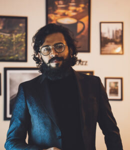

# Dr. Kohulan Rajan
## Visiting scientist

Dr. Kohulan Rajan is a Visiting Scientist at the Natural Products Cheminformatics Research Group at Friedrich-Schiller-University Jena, and Project Lead for AI & Automation at the Beilstein-Institut in Frankfurt. He completed his school education in Sri Lanka before moving to Bangalore, India, where he received his Bachelor’s degree in Biotechnology from Bangalore University. He then pursued a Master’s degree in Bioinformatics from Savitribai Phule Pune University.

In 2017, he joined the group of Prof. Dr. Christoph Steinbeck at Friedrich-Schiller-University Jena, completing his PhD (summa cum laude, 2021) under Prof. Steinbeck and Prof. Dr. Achim Zielesny. His research sits at the intersection of cheminformatics, deep learning, and computer vision. Notable projects include DECIMER.ai, an open platform for automated optical chemical structure recognition published in Nature Communications and adopted globally for chemical information extraction; COCONUT, the world’s largest freely available natural products database; and STOUT, a transformer-based tool for converting SMILES to IUPAC names. He holds a Google TPU Research Cloud Fellowship and was recognised with the CSA Trust Award in 2025.

Kohulan is passionate about many things. Outside research, Kohulan is a professional photographer, founder of Kohulan.R Photography and KO StudioZ. He writes poetry, short stories, and scripts in Tamil and English. His first Tamil poetry collection, Suvadugal (The Footprints), was published in 2013. He also holds several diplomas in the field of computer education, which includes animation and film editing.
